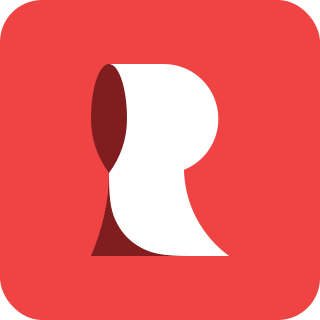

  

<h1 align="center">
  Redd Developer
</h1>

My personal blog.

## Technologies

- [Next.js](https://nextjs.org/) as the front-end framework;
- [MDX](https://mdxjs.com/) for post content.
- [Tailwind](https://tailwindcss.com/) for styling.

## About the author

Hi! My name is Artem and I am a self-taught software engineer. I am curating this blog in order to share the knowledge and experience on engineering and beyond. If you like my material consider following my on social networks:

- [**Twitter** (@kettanaito)](https://twitter.com/kettanaito)
- [GitHub (kettanaito)](https://github.com/kettanaito)

## License

> Although the source code of this blog is open sourced, it's not permitted to base another websites based on Redd Developer identity and visual style. The source code of this blog does not allow any modifications, and must serve solely for educational purposes.

The content of this blog is licensed under [CC BY-NC](https://creativecommons.org/licenses/by-nc/4.0/). You can mention, quote, and reference the content according to the aforementioned license.
