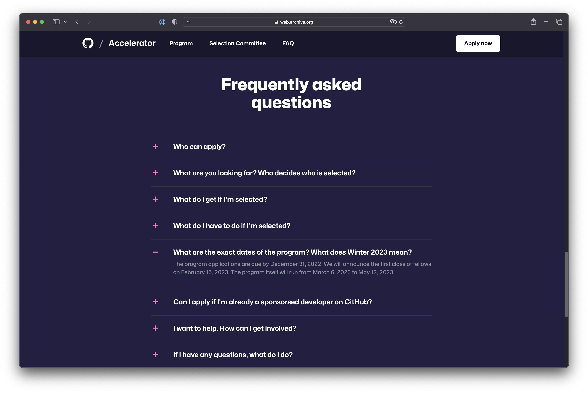
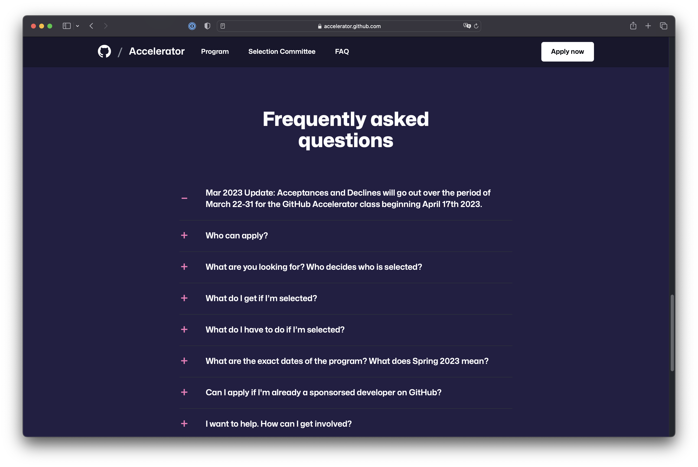

## What is GitHub Accelerator?

[GitHub Accelerator](https://accelerator.github.com/) is a program launched by GitHub in late 2022 with the premise to help open-source maintainers achieve financial sustainability. A class of unspecified capacity is selected from everybody who has applied to the program by the end of 2022, where each member would be sponsored directly by GitHub for $20,000 over the course of 10 weeks. Without a doubt, that is a life-changing amount of money for anyone, let alone maintainers struggling to keep their projects alive.

When I first found out about the program on Twitter, it sounded too good to be true. I've been doing open source for almost a decade, with some of my projects dusting forgotten and others peeking millions of downloads per week on NPM. I've been lucky. Lucky to get through, to get noticed, lucky for my ideas to get adopted by developers all over the world, and even get a bit of financial support. But, like countless enthusiasts out there, I haven't been lucky enough to work on my open source full-time. Instead, I'm pushing the innovation for free, sacrificing my free time over weekends. A sad but true open-source reality that GitHub seemed to have aimed if not to change then at least challenge.

After poking around in the “FAQ” section, I decide to apply to the first class of GitHub Accelerator the same evening. That meant recording a short introductory video where I tell about myself, my projects, and how this program could contribute to a better ecosystem for everyone. A successful submission screen encourages me and although I didn't get any email confirmation about applying, I keep my fingers crossed, waiting for the results to be announced on February 15th, 2023.

## Enter February

I'm finishing what's left of the St. Valentine's box of chocolate, frantically refreshing the program's website to tell me something new. At the back of my head, I'm going through all the emails I've ever sent to large companies using my open source that were successfully ignored. This has to be different. It's an official public program organized by one of the biggest open-source platforms in the world. I acknowledge the competition but it doesn't hurt to hope.

And so I sit there, hoping. February 15th comes and goes, but the website remains the same, still listing the date as the official deadline, even still showing the “Apply now” button despite the submission window being closed for 1,5 months now. Another day passes, then one more, then a week. The website continues to be stale, my email suspiciously quiet.



The state of the GitHub Accelerator website as of February 2nd, 2023.

Two weeks past the deadline, but I'm not losing hope. I have no doubt that is a gigantic initiative with hundreds if not thousands of developers applying. Opportunities like that are extremely rare, so what is another week of waiting?

## Enter March

The end of March stares back at me from the front face of my calendar. The last couple of weeks were busy with work, and I have let the program slip off my radar. A month after the official deadline, I go to check the website, hoping to find some happy faces whose lives would become a bit better because of the software they've created, even if mine wouldn't be among them.

I scroll through the page that appears disappointingly similar. “Aha!” I exclaim, noticing some paragraphs changing in the “FAQ” section. I give them a thorough read.



The state of the GitHub Accelerator website as of April 05, 2023.

The deadline for announcing the participants was moved to the end of March. Those were not the news I was expecting but those were some news nonetheless. I found it a bit strange that a change like that hadn't been communicated to participants in any way. An initiative is only as good as the communication behind it, in the end. And the communication behind GitHub Accelerator had been entirely absent from the start.

Already behind the schedule, two more weeks seemed like not a big deal. I had enough to do for that time to fly by in an instant.

## Enter… April?

The first week of April is nearing its end. Two months past the first promised deadline, seven days past the second, and only one more week before the first class is supposed to begin the program. I check the website yet again (this starts to sound like a fairy tale; third time a charm, I suppose?). Nothing. Well, that can't be right, something must be going on.

Out of curiosity, I check the last modified date on the site's pages:

```js
Last-Modified: Mon, 27 Mar 2023 01:05:58 GMT
```

Likely the first deadline update. In hindsight, an additional week was not enough to push through with the official announcements, emails, and the reveal of the winners. Is this a sign to expect another delay until May? If you ask me, that's highly likely.

## The problem

There is nothing wrong with moving the deadlines. Things like that happen, and I'm giving the GitHub team behind this program the benefit of the doubt, knowing they are doing their best to make it happen for everyone.

The problem is the communication or, to be more precise, the lack of it. Starting from the application form that doesn't result in a confirmation email, and ending with any lack of updates whatsoever sent to the participants. Keeping people in the dark isn't the best tactic, it only makes them think they have applied to a dark place. This is not the level of quality I would expect from GitHub, and certainly not the one from the biggest financial opportunity for OSS I've ever seen.

The silent changes to the website only pour oil into the fire. Changing the deadline is a big change. If it's not openly admitted and shared, what other big changes slipped through while nobody was refreshing the website?

## Final thoughts

When there's no feedback, assume the worst. In the case of GitHub Accelerator, it may just as well be that a potentially life-changing program that could've served as a bright example in promoting open-source sponsorships might have fallen victim to bureaucracy, priority shifts, or the basic lack of care. That is, of course, it if hasn't been canceled altogether months ago. I wouldn't be surprised if that was the case and the website would go down in a month, leaving no trace of an otherwise admirable initiative.

And yet I want to hope for the best. I hope the team fights through whichever internal mess they are fighting through and pulls off a remarkable program to support those who matter in this story—engineers with vision and passion. I hope to read the announcement on Twitter but I won't be checking the website anymore.
