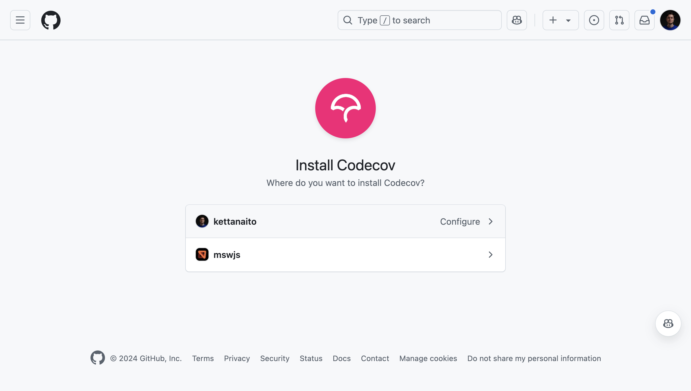
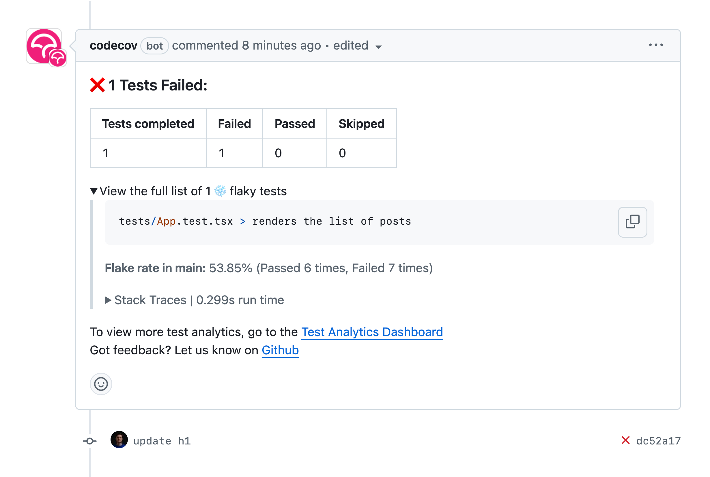
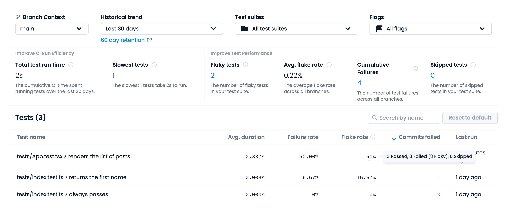

Test flakiness is a big issue. Not only can it be a colossal time investment to detect and fix, but it hurts perhaps the biggest value you get from your tests—their trustworthiness. A test you cannot trust is a useless test. Time spent maintaining a useless test is time wasted.

I've already shared with you a [practical guide on addressing flaky tests](https://www.epicweb.dev/be-smart-about-flaky-tests), but today I'd like to talk about what it all starts from. **Detecting flakiness**.

## The roots

One thing I learned over the years of testing is that flakiness can hide its roots in every layer of your system. From the way you write the test to the test setup and the tools you're using. Even in the hardware that runs all of that! And the more layers your test involves, the easier it is for the flakiness slip through.

It's not a coincidence that end-to-end tests are notoriously known to be flaky. There are a lot of things at play between the two ends. Add to that a generally higher cost of maintenance, and you've got yourself a problem nobody in the team wants to deal with.

The worst thing of all is that the sporadic nature of flakiness makes it compellingly easy to brush off an ocassionally failed test. When so many layers are involved, who knows, perhaps it was a hiccup somewhere down the line. Just hit the "Rerun" button, see the test passing, and move on with your day.

Sadly, that is how most teams approach flakiness at its early stage. Ignore it once, then twice, and, suddenly, you are gambling on the CI results of your product, pulling those reruns just to see it turn green.

> I've talked with teams that have given up on the whole idea of E2E testing because of how unreliable their test suites eventually became.

That's now how automated tests are supposed to work.

## Catching the flakes

In larger teams, flakiness can slip through your fingers in no time. You may not be the one experiencing it, or rerunning the tests, or being affected by it in any way. Until you are. It is rather nasty to find yourself in a situation when an important pull request is stalled until you win the rerun game. I've been there. That's why I put a ton of effort into keeping my builds green at all time, eradicating flakiness as soon as it surfaces.

It is all the more useful to have tools by your side to help you detect and track flaky tests across your product.

Recently, Sentry has announced its Test Analytics and I wanted to try it straight away. And the best way to try is to reproduce one of the common mistakes that leads to flakiness and see how it would help me catch and fix it.

## The test

Here I've got a basic in-browser test using [Vitest Browser Mode](https://vitest.dev/guide/browser/):

```tsx
import { render } from 'vitest-browser-react'
import { screen } from '@testing-library/react'
import { worker } from '../src/mocks/browser.js'
import App from '../src/App.jsx'

beforeAll(() => worker.start())
afterAll(() => worker.stop())

function sleep(duration: number) {
  return new Promise((resolve) => {
    setTimeout(resolve, duration)
  })
}

it('renders the list of posts', async () => {
  render(<App />)

  await sleep(250)
  const posts = screen.getAllByRole('listitem')

  expect(posts).toEqual([
    expect.toHaveTextContent('First post'),
    expect.toHaveTextContent('Second post'),
  ])
})
```

This one concerns itself with testing the `<App />` component that renders a list of user's posts. Fairly simple. For those sharp of eye, you've likely already spied the problem with this test, but let's imagine I didn't. I wrote it, ran it, saw it successful, got the changes approved, and now it runs on `main` for everyone in my team.

Let's see how the experience will look like for me (and my teammates) if I've got test analytics set up to track flaky tests.

## Getting started with Test Analytics

Test Analytics is a free feature that can be used standalone or as a part of Codecov (if you've used it before). You can integrate it in your project in three steps.

### Step 1: Install Codecov app

For starters, make sure you have the Codecov app installed on GitHub and authorized for the repositories you want to add Test Analytics to.

- [Click here](https://github.com/apps/codecov/installations/select_target) to install the Codecov app on GitHub.



### Step 2: Configure Vitest

Test Analytics works by parsing the results of your test run in JUnit format (don't worry, you don't have to actually use JUnit!). I use [Vitest](https://vitest.dev/) in my project, and luckily it supports emitting the test report in that format.

Provide `junit` as a test reported to Vitest in `vitest.config.ts`:

```ts
// vitest.config.ts
import { defineConfig } from 'vitest/config'

export default defineConfig({
  test: {
    reporters: ['default', 'junit'],
    outputFile: './test-report.junit.xml',
  },
})
```

> I've also added the `default` reporter so I can still see the test output in my terminal like I'm used to.

And yes, Vitest supports different reporters _and_ code coverage in the Browser Mode too!

### Step 3: Upload test reports

The only thing left to do is to run automated tests on CI and upload the generated report to Codecov. I will use GitHub Actions for that.

```yml
name: ci

on:
  push:
    branches: [main]
  pull_request:
  workflow_dispatch:

jobs:
  test:
    runs-on: ubuntu-latest
    steps:
      - name: Checkout
        use: actions/checkout@v4

      - name: Install dependencies
        run: npm install

      - name: Install browsers
        run: npx playwright install chromium

      - name: Run tests
        run: vitest

      - name: Upload test results
        # Always upload the test results because
        # we need to analyze failed test runs!
        if: ${{ !cancelled() }}
        use: codecov/test-results-action@v1
        with:
          token: ${{ secrets.CODECOV_TOKEN }}
```

> Learn how to create the `CODECOV_TOKEN` [here](https://docs.codecov.com/docs/codecov-tokens).

Notice that the upload action is marked to run always (`${{ !cancelled() }}`) so we could analyze the failed test runs as well.

## Reading the analytics

Once the setup is done, you will start getting reports in your pull requests highlighting overall test results and also any detected flakiness.

Once someone encounters the flakiness coming from my test, they will see an immediate report from Codecov right under the pull request:



A more detailed report is available on [Codecov](https://app.codecov.io/). Open your repository and navigate to the "Tests" tab that will contain the Test Analytics Dashboard.

Here's how the test anlytics report looks like on the `main` branch:



I can see straight away that the test I've introduced has been flaky on `main` ("renders the list of posts"). That won't do!

There's also a lot of other metrics on display here, but the most useful criteria for me are:

- **Flaky tests**, the list of unreliable tests I have;
- **Slowest tests**, the list of tests that take most time to run;
- **Average flake rate,** to help me monitor my efforts as I go and fix flaky tests across the entire project.

With the way to track that problematic test, it's time for me to fix it for good.

## Fixing the test

Normally, I would start from skipping the flaky test from the test suite entirely. But in this case, I already know the root cause so I can propose a fix straight away.

The reason this test is flaky hides in plain sight:

```js
await sleep(250) // ❌
```

Using `sleep` in test is a terrible idea. Your intention is never to wait for a certain time but rather to wait for a certain _state_.

In the `<App />` test case, that state is when the user posts response comes in and the list of posts renders in the UI. I need to rewrite the test to reflect just that:

```diff
-const posts = screen.getAllByRole('listitem')
-await sleep(250)

+const posts = await screen.findAllByRole('listitem')
```

By swapping the `getAllByRole` query with the `findAllByRole` I am introducing a promise that will resolve once the list items are present on the page. Lastly, I `await` that promise, making my test resilient to how long it takes to fetch the data.

And with that, the flake is gone! 🎉

> TODO: Add the "All tests are passing" screenshot once the GitHub comments start coming in.

## Full example

You can find a full example of using Test Analytics with Vitest on GitHub:

- TODO: Link to the repo.

## Resources

- [**Test Analytics documentation**](https://docs.codecov.com/docs/test-analytics)
- [Find failing and flaky tests with Codecov Test Analytics](https://about.codecov.io/blog/find-failing-and-flaky-tests-with-codecov-test-analytics/)
- [Be S.M.A.R.T. About Flaky Tests](https://www.epicweb.dev/be-smart-about-flaky-tests)
