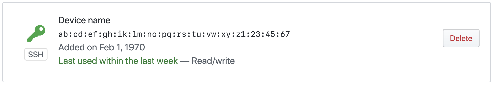
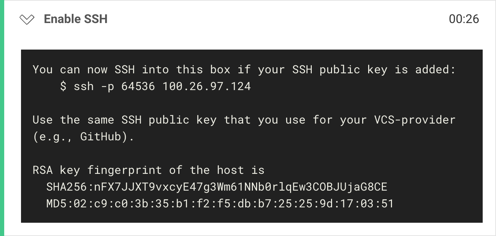
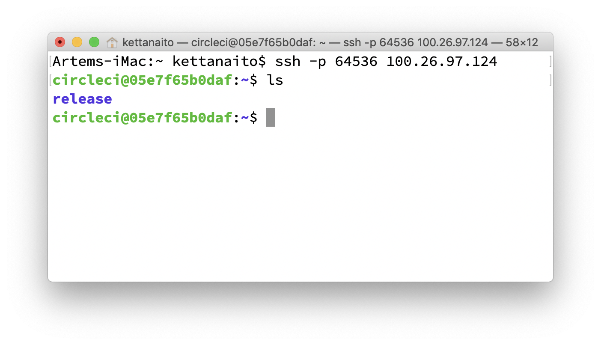

## Introduction

I have been actively using [CircleCI](https://circleci.com/) in my projects for years now and I love it! However, I'm ashamed to admit that most of the failed jobs took me up to 1 hour to get right. By the time I saw CI pass, I had grew an unrivaled hatred towards the red color.


In this post I would like to share a mind-blowing technique of debugging failed CircleCI jobs suggested by [Ricardo Feliciano](https://twitter.com/FelicianoTech). As the time passed, I have adopted this technique even outside of CI, but I believe there are developers who are as alien to this approach just as I once was. I will also add a few personal tricks and tips to make the most out of this topic. Let's learn how to resolve failed jobs in a fast and efficient manner.

---

## Reproducing an issue

Reliable issue verification is the absolute must in order to resolve any problem. We follow steps not only to reproduce an issue, but also to verify when it's been successfully fixed. There is a myriad of things that can affect an issue's reproduction: environment, connection speed, asynchronicity, dark magic. When your CI runs remotely, all of those factors are, inevitably, at play.

<Quote>The issue that cannot be reproduced cannot be fixed.</Quote>

Thus, whenever a remote job fails, it's in our best interest to match the context in witch it failed as close as possible to provide a viable fix. Gladly, there is a way to connect to the very machine that's running our job and explore its state. Enter SSH.

## SS-what?

**Secure Shell** (also SSH) is a network protocol that encrypts data packages sent over an insecure connection. SSH establishes a tunnel between a verified client and a server, encrypting any data that flow in-between.

Originally designed by [Tatu Ylönen](https://twitter.com/tjssh) in Helsinki University of Technology, SSH has been widely adopted, gradually becoming a standard in software engineering. Most of the websites you visit today use SSH for various purposes, like sendind and acceptind traffic, or transfering files.

In this tutorial we are primarily interested in these applications of SSH:

- Logging to a shell on a remote host (machine);
- Transferring files.

## SSH setup

Connecting to a remote host via SSH is like openning a door: one requires a key. An SSH key allows a remote machine to recognize a connecting host and decide whether to grant access. For the purpose of this tutorial I presume that your CircleCI is connected with your **GitHub acount**. This means that GitHub will be responsible for providing your SSH key to CI.

> You can skip this section if you are familiar with SSH keys and have an SSH key generated and connected to your CircleCI account.

### Check existing SSH keys

First, check if you don't have any SSH keys already on the [SSH and GPG keys](https://github.com/settings/keys) page in your GitHub account. In case you do, you should see the list of your active SSH keys:



Alternatively, check for any existing SSH keys on your local machine by running:

```bash
$ ls -la ~/.ssh
```

Running the command above will list the available SSH keys, if any. SSH keys file names usually look like this:

```
id_rsa.pub
id_ecdsa.pub
```

In case you don't have any SSH keys, or would like to create a new one for the sake of this tutorial, please follow the instructions below.

### Cretate new SSH key

First, let's generate a new SSH key:

```bash
$ ssh-keygen -t rsa -b 4096 -C "your_email@domain.com"
```

> Use your GitHub user email.

- `-t`, a type of a key to create (`dsa`, `ecdsa`, `ed25519`, `rsa`);
- `-b`, the number of bits in the key (for the `rsa` key type should be greater than `768`);
- `-C`, a key comment. The value of this comment is an email that is going to be validated to identify your connections.

Running the `ssh-keygen` command above will ask you where to save a newly created SSH key, and you can choose the default option, which would be in the `~/.ssh` directory. You may also choose to encrypt your new SSH key with a pass-pharse, just bear in mind you would have to enter it each time you use that key.

Verify that a new SSH key has been created by running the following command:

```bash
$ ls -la ~/.ssh
# Should return the list of files that includes your newly created SSH key:
#
# -rw-------   1 username  staff  1234 Feb  1  2020 id_rsa
# -rw-r--r--   1 username  staff  1234 Feb  1  2020 id_rsa.pub
```

### Add SSH key to ssh-agent

Regardless of which SSH key you've decided to use, it must be added to yout ssh-agent. Think of SSH agent as a keychain that stores your SSH keys.

Start the agent in the background:

```bash
$ eval "$(ssh-agent -s)"
# Agent pid 12345
```

Modify your `~/.ssh/config` file by adding the following section:

```bash
Host *
  AddKeysToAgent yes
  UseKeychain yes
  # Point to the generated SSH key
  IdentityFile ~/.ssh/id_rsa
```

Lastly, add the SSH key to the agent:

```bash
$ ssh-add -K ~/.ssh/id_rsa
```

- `-K`, is a MacOS-specific option that tells ssh-agent to store your key in the keychain. Skip this option when using a different OS.

Verify that you have got your SSH key loaded to the agent by running this command:

```bash
$ ssh-add -l
# 4096 SHA256:03eb924754b981b2aed90b699ff513cb0b6f4f93c35 your.email@host.com (RSA)
```

### Add SSH key to GitHub

Please follow the official instructions on [Adding a new SSH key to your GitHub account](https://help.github.com/en/github/authenticating-to-github/adding-a-new-ssh-key-to-your-github-account). Once successful, you should see the SSH key in your [SSH and GPG keys](https://github.com/settings/keys) page.

---

## Running CircleCI job with SSH

Once our SSH setup is done, let's switch to the CI part. In order to ssh into a remote host responsible for a particular job, that job must be run with SSH first. You can do that directly from the CircleCI UI by following these instructions:

1. Open a failed job's detail page.
1. Locate the "**Rerun workflow**" button.
1. Open the dropdown and choose "**Rerun job with SSH**" option.


Clicking on the option will run the respective job anew, yet this time CircleCI will issue an SSH connection to the remote machine. You can notice that a new step has been added that describes details of that connection:



Those details are likely be different in your case, but your primarily interest should fall onto the machine's host (`100.26.97.124`) and port number (`64536`). Remember those. CircleCI would also print out a shorthand connection command, which we are going to use in the next step.

## Into the remote!

### Using default key

(Recommended) If your main SSH key is the one associated with your GitHub account, execute the SSH command CircleCI printed out in the "Enable SSH" step:

```bash
$ ssh -p 64536 100.26.97.124
```

### Using explicit key

In case you have got multiple SSH keys you would have to specify which one to use to connect to the remote machine. Provide the path to the same SSH key you use for GitHub as the value of the `-i` flag in `ssh` command:

```bash
$ ssh -i ~/.ssh/id_rsa -p 64536 100.26.97.124
```

### Establishing connection

Using a UNIX-based computer, you can connect to a remote SSH server by running `ssh` command:

```bash
$ ssh -p 64536 100.26.97.124
```

> Answer "yes" if prompted with "Are you sure you want to continue connecting".
> When successfully executed, you will notice your terminal's working directory changing to the remote machine's name. Any commands issued in this process from now on are executed on the remote machine. For example, we can run the entire build again, or each command in isolation (i.e. `npm test`, or `npm run build`).



By default you are going to see the `/home/circleci/` directory opened. Depending on your CircleCI configuration you will have a different directory tree there. In my case I have configured my job to run in the `~/release` folder:

```yml
version: 2
jobs:
  build:
    working_directory: ~/release
    steps:
      - checkout
      - ...
```

Pay attention to your setup and directory structure when applying commands used in this article. I am going to list those according to my setup to remain consistent.

## Taking a snapshot

Working with a remote file-system is helpful, but you might quickly find yourself limited. It is a different environment that lacks your favorite IDE and other helpful tools you use for debugging. It may be helpful to know how to download directories and files from the remote machine.

Although you should strive towards your project being reproducible, I highly recommend to download a complete snapshot of the file-system, _including installed dependencies_. This way you eliminate any possible deviations and operate on the 1-1 instance of your project from the failed job. Depending on the project's (and its dependencies) size, transferring its entire directory may take a significant amount of time. We can compress the working directory into a tarball to decrease its size and make the download procedure faster.

Being on the remote machine let's compress the current working directory into a tarball archive:

```bash
$ tar -czvf snapshot.tar.gz ./release
```

- `-c` create an archive;
- `-z` compress the archive using gzip;
- `-v` display progress in the terminal (verbose);
- `-f` accept a file name of the archive.

After the archive is created you can transfer `snapshot.tar.gz` using SCP ([Secure Copy Protocol](https://en.wikipedia.org/wiki/Secure_copy)). Open a new terminal window, because **you need to be on the local machine** to do this step.

```bash
$ scp <OPTIONS> <USER>@<HOST>:/<SRC_PATH> <DEST_PATH>
```

```bash
$ scp -P 64536 circleci@100.26.97.124:/home/circleci/snapshot.tar.gz ~/Desktop
```

- `-P` connection port to use (default is `20`).

This command will copy the file at `/home/circleci/snapshot.tar.gz` from the remote machine to your local `~/Desktop`. Unarchive the snapshot of the CI and debug it as if it was a regular folder, because it is now.

## Afterword

Thanks for reading through this article! I hope it will be of good use to you when debugging the next failed CI. Let me know your thoughts on the topic [on Twitter](https://twitter.com/kettanaito)!

---

## Links & Materials

- [Debugging with SSH](https://circleci.com/docs/2.0/ssh-access-jobs/) (CircleCI documentation)
- [What are SSH keys?](https://jumpcloud.com/blog/what-are-ssh-keys/) by JumpCloud
- [Connecting to GitHub with SSH](https://help.github.com/en/github/authenticating-to-github/connecting-to-github-with-ssh)
