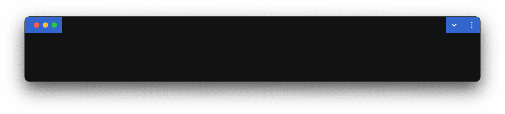
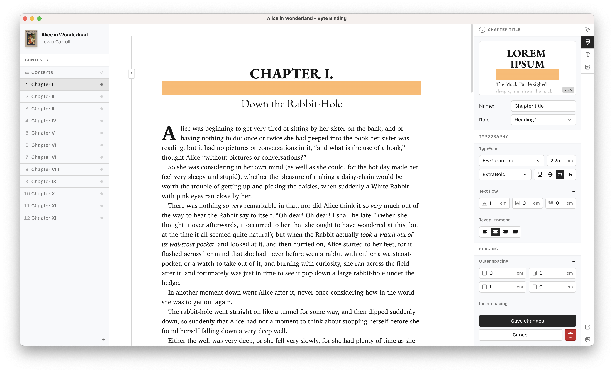

I've spent a year building an Electron application. Then, I decided to make it into a PWA. One of these decision was a terrible mistake that cost me a ton of time. Today, I'd like to share what I learned and talk about my experience of, effectively, recreating the same app with two drastically different technologies.

## Problems with Electron

A good place to start is to establish that Electron fits the needs of my app remarkably well. I am building an [EPUB editor](https://bytebinding.com), which means a lot of text rendering and manipulation—precisely where the browser excels. That is also why I wasn't considering any of the Electron alternatives, even despite the fact that most of them aren't full alternatives, to begin with.

So if Electron was the perfect fit, why even consider anything else? Well, there were a couple of reasons.

### Bundle size

First, it's the bundle size. Electron apps are notoriously heavy. Chromium shell is ~250MB from the get go. This is before you write any of your own code. That number, and the cost of bandwidth that came with it, loomed over me throughout the entire year of development.

In hindsight, that fear was entirely premature and laughably disproportionate. Even the low-end hardware today comes with gigabytes of storage, the network speed is generally fast, and a browser tab with a Twitter post open likely eats more RAM than your entire Electron app ever will. Providers like Cloudflare also don't charge egress costs, which makes the size of the installer irrelevant when the users download it.

I won't deny that poor architecture and blind slopmanship can lead to bloated, slow, RAM-hungry apps. Neither will I be hesitant to point out those feats can be achieved in any other language and technology to much the same success.

### Boilerplate

It is amusing, however, that the majority of Electron's "criticism" revolves around the bundle size and not the fact that building Electron apps is the closest thing to 2000s era of web development one can experience today. I'm talking server-first, heavy and clunky sites that reload the entire page on any meaningful interaction. _That_ is the real problem with Electron, but it's not Electron's fault.

I came to recognize Electron as a low-level tool. It is to desktop apps what JavaScript is to React, if you forgive the comparison. There's no established patterns, no quality-of-life development features, like HMR, no window management, no proper type-safe IPC, even no direct means to handle app updates.

> Electron is a low-level tool in a dire need of a framework.

I dread to think about having to build with Electron directly. Luckily, I don't have to. There are quite a few projects that aim to address some of those issues, projects like `electron-builder` and `electron-vite`. It is worth saying that although they provide an immense improvement around bundling and distribution, they do not constitute a framework, and so a huge chunk of essential features remains missing.

And so I set off to explore some alternatives that wouldn't require rewriting a year of work in Rust.

## Progressive Web Apps

Electron apps and progressive web apps (PWA) are more similar than you might think. Both are written in and execute JavaScript, run in a browser shell, and are remarkably close in computing capabilities—from working with the file system to image/audio/video processing. People have recreated entire graphic and video editors as PWA much to the testament of how powerful the browsers have become.

Additionally, PWA come with a set of unique benefits:

- They are tiny in size;
- They execute _instanteneously_, both thanks to their size and progressive enhancements (e.g. Server Workers);
- They run on mobile as well as desktop;
- Their update mechanism is well-documented and works out of the box;
- System interactions, like opening or saving files, are times faster and snappier than in Electron;
- They are an order of magnitude easier to test.

Depending on how you've designed your application, swapping Electron with PWA might not even be that time-demanding of a task. The biggest architectural difference is that PWA do not involve Node.js, spreading its compute across the client and the workers. That is as limiting as it is beneficial. Personally, I have severely understimated the perfomance benefit of delegating certain operations to the client, thus bringing them closer to the view layer.

After a quick prototype, I was convinced this might work and began rewriting my app to be a progressive web app. I must admit, that rewrite went rather smoothly, with the majority of my time focused on rewriting main thread functionality to browser APIs and turning them into standalone workers. I even kept some of those changes after I migrated back to Electron because they showed me a simpler way to solve the same problem.

My only regret is that I wish I realized certain PWA shortcomings before investing six months into this rewrite. Because, as it will turn out, those shortcomings would become a dealbreaker for my application.

## Problems with PWA

Progressive web apps address more problems than just bringing a web app to the desktop. That's why you can benefit from a lot of progressive enchancements they offer without considering the desktop at all. Any point of observation or criticism toward PWA in this article comes only from the desktop aspect of the technology, which doesn't make it all-encompassing and, really, doesn't even make it a proper critique.

I have no intention of critiquing PWA. My goal is to share what I learned about it and highlight certain limitations that were not that much apparent and that may or may not be relevant to the apps that you're building.

### Varying API quality

Since my app primarily deals with files, I was quick to discover that not all file APIs were made equal. [File System API](https://developer.mozilla.org/en-US/docs/Web/API/File_System_API) and OPFS are phenomenal from start to finish. When it comes to handling file associations and launch parameters though, I was in for a rough ride.

In the first weeks of picking up PWA, I've reported two [major](https://github.com/WICG/web-app-launch/issues/96) [bugs](https://github.com/WICG/web-app-launch/issues/97) that rendered their respective APIs useless. These were not niche things that only three apps in the world used. These were fundamental APIs for opening files through your app. And given how you cannot just add a browser-level functionality yourself, it was the end of the road. I couldn't have that capability in my app. Wipe the tears and move on.

Then, there were APIs that behaved differently across browsers, and some just refused to work altogether (looking at you, Safari). Your PWA will always be opened in the same browser from which it was installed. So if the user had the misfornute to be interested in your software in imaginary Safari, well, too bad for them and for you.

> It was roughly at the point when I seriously considered limiting my app's installation to Chrome-based browsers that I realized I wasn't using the technology, I was fighting it.

All of this led me to believe that, sadly, PWA is severely lacking in developers using it meaningfully and the browsers treating it seriously.

### PWA isn't a desktop app

I cannot express how hard it is to make a PWA look like a desktop app. I'd rather style emails until the end of my days. With no comedic intention whatsoever, this is the absolute pinnacle of what you should expect:

If this doesn't look like a broken malware your younger sibling managed to sneak on your computer, I fear you and I have different taste in software. The official guidance on [window controls customization](https://web.dev/articles/window-controls-overlay) suggests to mask that atrocity with gradients or other CSS magic. I still think this is a poorly-timed April fools joke.

This is an unacceptable level of thought toward any API, let alone the one whose very purpose is to help developers brings web apps to the _desktop_.

But alright, this is just the title bar and its customization is prevalent on macOS only anyway. With heavy heart, let's brush this off.

There's still plenty of things that PWA simply cannot do. Things that your users expect from a desktop app. Things your users will be sad, if not frustrated, to see missing. Here's just some of them:

- You cannot customize the tray or dock menus;
- You cannot have system-wise hotkeys;
- You cannot have certian hotkeys at all (Cmd+S and Cmd+Q are reserved by the browser);
- You cannot integrate a PWA into the OS to have things like "Open with MyApp" in the system context menu.

I'd argue the system-level integration is the first thing I'd address when designing _desktop_ experiences, and yet they are exactly the things where PWA is the weakest.

### Miscellanious

On top of that, there are a bunch of little issue-esque things that come bundled with progressive web apps. Users are still unfamiliar with the concept and to many of them the means of discovering and installing a PWA will be entirely alien. Browsers don't exactly make this easier. You cannot install a PWA by a click of a button, you have to find that tiny, unassuming icon somewhere next to your URL, which means you need to know where to look. This might be negligible for a hobby project, but if you're building software for a living, you sure want your software to be discoverable.

> I'm sure there were quite a few other things I found irksome, but since I'm writing from the top of my head and cannot recall them, they must have been trivial enough not to deserve a memory.

## Back to Electron

What is there left to say? I ended up migrating back to Electron. Well, I took a brief detour with Electronbun, but that's a story for another day.

For those curious, this is how my application looks like:

## Conclusion

As it stands today, PWA is a good _addition_ to existing _websites_, but in no shape or form a viable alternative for building desktop apps. It excels at enhancing web experiences but fails miserably when it comes to the most basic desktop expectations.
 
This conclusion isn't that pessimistic. A lot of Electron apps I see are just websites in a shell, and they would be **times better off being PWA**. The code base would get leaner, tests better, and apps smaller, all without losing a single functionality.

For anything else, I would use Electron. With a few dependencies on top and, hopefully, a proper framework that somebody who spent his last two years working with Electron would build. One can only dream.

This introspection truly made me sad about the state of things in PWA. Don't get me wrong, if it nails the missing bits and gets the love it's so desperately missing, PWA can become the main way of building web-based apps on the desktop. But as of now, it's nothing more than a shortcut to open your site faster and maybe have it work offline. This is barely scratching the surface of what PWA are capable of and yet this is what most developers use them for. I suppose there's some clever irony hidden somewhere in here.
