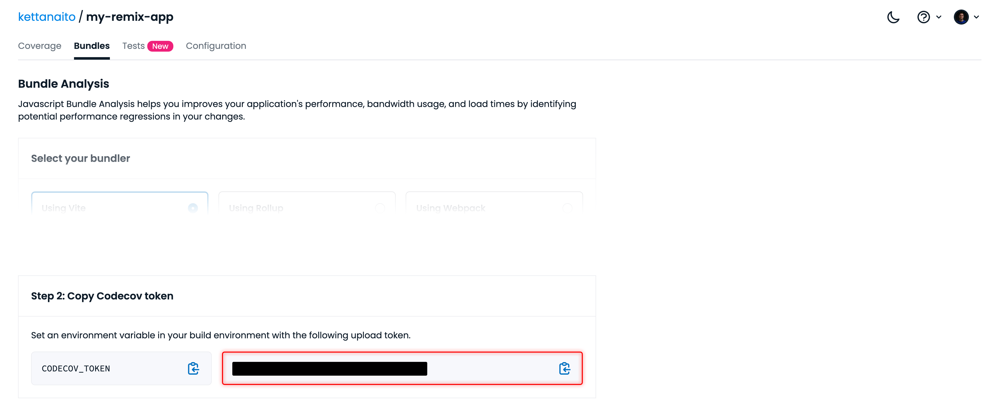
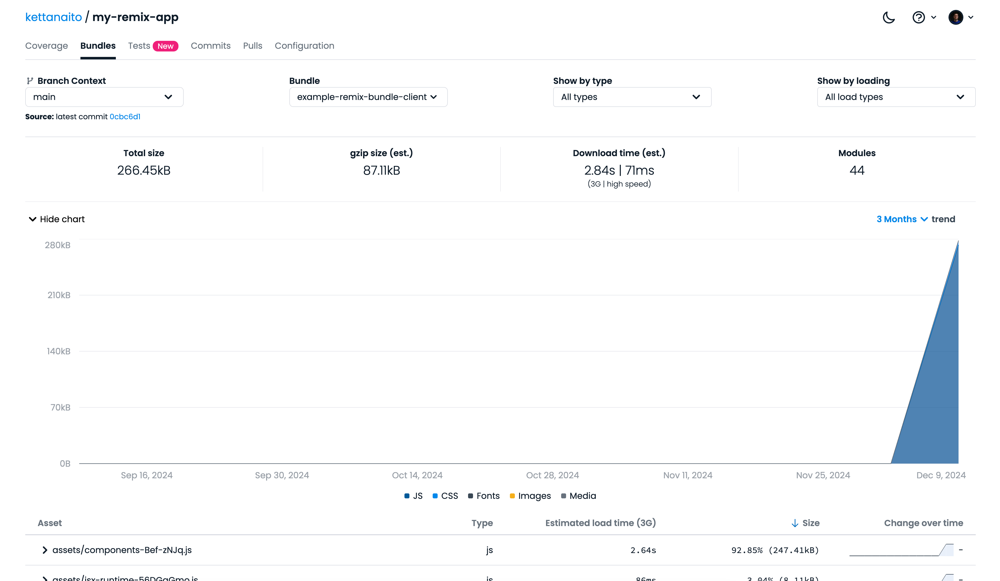
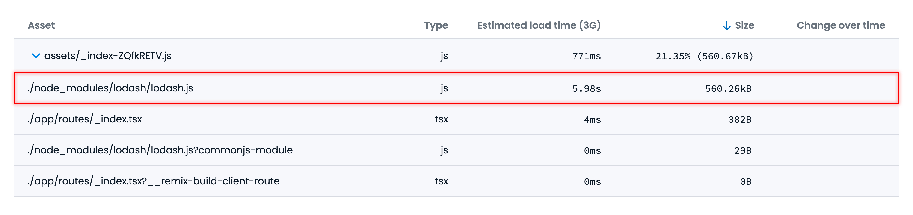

Performance is a crucial part of good user experience. We all want to use software that is snappy and responsive, the kind that almost feels like it does things faster than you think about it. The kind that reminds you about the magic of compute.

In practice, performance is two sides of the same coin. On one side, you've got an _actual_ performance that involves the speed with which the server responds with the resources and the browser parses and evaluates them. On the other, there is a _perceived_ performance described in how fast your website "feels".

Although it may seem like it, those two are not the same. You may have two identical applications that take 2 seconds to load, but one will manage to feel faster than the other. Why is that? Well, it often comes down to one thing.

**Progressive enhancement.**

There is a universe of difference between going from a blank browser tab to a fully painted page at 2s mark and serving the first element to the user at 0.2s, then loading the rest in the remaining 1.8s. In the end, your application is only ever as fast as your users feel it is.

Luckily, there have been a lot of improvements in monitoring and implementing progressive enhancement in web applications. All modern frameworks provide you with code splitting and lazy loading as well as encourage best practices when it comes to building your apps. In other words, they allow you to do more within the same load time window.

But you can also reduce that time window itself by serving _less code_ (mostly JavaScript, let's be honest). My favorite way to do that is to rely on the platform. You may not have realized this, but the browsers have shipped a ton of incredible APIs in the recent years, which means you can shave off some of the dependencies in favor of the platform. Here a few of my favorite APIs that are now available in the browser:

- [View Transitions API](https://developer.mozilla.org/en-US/docs/Web/API/View_Transitions_API) for smooth animations between pages;
- [Scroll Snap](https://developer.mozilla.org/en-US/docs/Web/CSS/CSS_scroll_snap) in CSS to implement controlled scroll experiences, like carousels and transitions;
- [Popover API](https://developer.mozilla.org/en-US/docs/Web/API/Popover_API) in HTML for flexible, customizable tooltips.

Quite the same applies to JavaScript as it provides more and more native functionality to make your apps shine. Of course, the platform cannot do everything for you. Its purpose is to give you the building blocks, and your task is to craft great user experiences by expanding on them with your own touch.

This is why keeping track of how much code you ship and how your bundle size changes over time is quite important. Today, I would like to talk about the tooling that can help you do that, featuring the recent [Bundle Analysis](https://docs.codecov.com/docs/javascript-bundle-analysis) feature from Codecov.

## Getting started

### Step 1: Install GitHub App

First, add the Codecov app to the repo(s) where you want to use it:

- Click [here](https://github.com/apps/codecov/installations/select_target) to install the Codecov app on GitHub.


### Step 2: Install plugin

Next, integrate Bundle Analysis into your build pipeline.

In my case, I am using Remix, and there's a designated Vite plugin prepared just for me!

```sh
npm i @codecov/remix-vite-plugin
```

> Take a look at the [Getting started](https://docs.codecov.com/docs/javascript-bundle-analysis#getting-started) section to find the best way to integrate Bundle Analysis with other frameworks, like Astro, Next.js, Nuxt, and many more.

You can add that plugin to your `vite.config.ts`, providing it with the following options:

- `enableBundleAnalysis`, the flag that tells Codecov to analyze your output bundle;
- `bundleName`, the name of the bundle (i.e. your project);
- `uploadToken`, the API token to connect bundle size reports to a particular repository imported in Codecov.

```ts
// vite.config.ts
import { vitePlugin as remix } from '@remix-run/dev'
import { defineConfig } from 'vite'
import tsconfigPaths from 'vite-tsconfig-paths'
import { codecovRemixVitePlugin } from '@codecov/remix-vite-plugin'

export default defineConfig({
  plugins: [
    remix(),
    tsconfigPaths(),
    // 👇👇👇
    codecovRemixVitePlugin({
      enableBundleAnalysis: true,
      bundleName: 'example-remix-bundle',
      uploadToken: process.env.CODECOV_TOKEN,
    }),
  ],
})
```

You can get the `CODECOV_TOKEN` from the [Codecov Dashboard](https://app.codecov.io/) by going to your repo, then "Bundles", then copying the token from the instructions:



Then, put that upload token in the `.env` file for Vite to pick it up during the build and provide it to the plugin.

```dot
# .env
CODECOV_TOKEN=YOUR_TOKEN_HERE
```

### Step 3: Upload report

With the setup complete, you can now view the bundle size reports after you build your application (locally or on CI):

```sh
npm run build
```

This will trigger the Vite plugin and upload the bundle size report to Codecov Dashboard, where you can find a more detailed overview of the client and server bundles your application uses:



Congratulations 🎉 You've integrated Bundle Analysis into your app!

But what's next?

## Bundle Analysis in action

I find that the biggest value in tools like Bundle Analysis is incremental monitoring, helping me observe how my bundle size changes as I develop my application.

For example, just recently I had to do a lot of work with objects in one of my projects so I used `lodash` because I remember I liked working with it in the past. After I pushed the changes to the remote, I got a summary report from Codecov and, well, it didn't look good.



Ouch! That's extra **560 KB** leaking into my app's bundle 😱! Including the entirety of `lodash` just because I need one utility function isn't very progressive.

After a quick search, I learned you can install standalone Lodash utilities like `lodash.get` to reduce the footprint of the library, which is nice. After a bit more thorough search, I learned I didn't even need Lodash for my use case because there's a [`Map.groupBy()`](https://developer.mozilla.org/en-US/docs/Web/JavaScript/Reference/Global_Objects/Map/groupBy) standard API that I can use instead!

Situations like this may seem trivial, but unapparent size bumps can creep into your JavaScript bundle at any time, and it's great to have some automation in place to know when that happens and also to see the price behind every change.

## Best practices

That being said, I would be cautious about using any kind of automation to allow or prevent changes to my app. While seeing sudden spikes in bundle size is something I want to catch, I wouldn't want it to go the same route as [Code Coverage](https://www.epicweb.dev/making-use-of-code-coverage), becoming obtrusive and defeating its own purpose due to being misused.

So instead, setting up a reasonable bundle size threshold would be a great place to start:

```yaml
# codecov.yaml
bundle_analysis:
  # Inform me about any bundle size changes that increase
  # the 5% of total current bundle size of my app.
  warning_threshold: '5%'
  status: 'informational'
```

From here, I can rely on Bundle Analysis to notify me about any bundle size increase caused by my changes and _decide how to handle them appropriately_. Sometimes the increase will be inevitable because we do have code to ship. Other times, it may be an incorrect (or even redundant) usage of a dependency. Ultimately, it is my decision as an engineer to know the difference between the two and act in the best interest of my users.

## Conclusion

With the abundance of powerful frameworks and great monitoring tools, there is no excuse to ignore progressive web enhancement in 2025. The good thing is that you can always start small, like monitoring how your application assets grow over time. From there, you can employ more techniques, like resource preloading, caching, going offline-first, or supporting optimistic updates, just to name a few.

I hope this article was helpful and that Bundle Analysis will help you feel more in charge of the code you ship and the impact it has on the user experience you want to achieve.

## Resources

Here are a few additional resources that can come in handy when diving into bundle analysis:

- **[Bundle Analysis documentation](https://docs.codecov.com/docs/javascript-bundle-analysis)**
- [Remix (Vite) Quick Start Guide](https://docs.codecov.com/docs/remix-vite-quick-start)
- [Try Bundle Analysis standalone](https://docs.codecov.com/docs/bundle-analyzer-quick-start)
