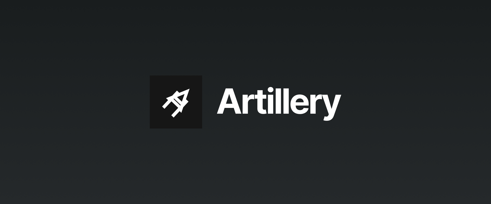

## Friends, announcements, and messages

Although it certainly feels much longer than than, a couple of months ago I announced on Twitter that I was looking for a new job. Frankly, I wasn't counting much on social networks, despite befriending so many wonderful people there over the years. I simply wanted to share the news.

There I was, deciding whether it's worth the effort to come up with a new resume or simply use my GitHub in its stead, when things began to change. One after another, people started reaching out to me, offering support but also inviting me to chats and calls to see if I could fit their teams. Just in the first few days after my announcement I received about two dozens of messages from every corner in the world, it seemed, all interested in joining forces to build something together.

I got lucky. There's no other way to put it. Yet again I owe so much to my online friends for helping me, this time in a career-defining moment in my life. I try to give back with the open-source and community work that I do, but I still feel at least a drink from my side is in order (I'll have juice, and you can totally join me). But it wasn't luck alone that did it.

Much to my own surprise, the majority of folks reaching out knew who I was and what I do. They knew about MSW, or Naming Cheatsheet, or maybe just heard my name referenced by someone they follow and trust. Either way, it was the farthest thing from a blind recruiter spam that I've used to associate job hunt with. It was good, to say the least.

I wish I was half as good replying to every single message I got. I did my best but if I never wrote back to you, please do not think ill of me. It was simply too much to handle at times.

## Engineering and beyond

That being said, I was still used to a more conventional job search and so I sat down and, as I always do, put up a list. This time, it was a list of the companies whose products excited me, or who did something I'd like to do, or simply who had the vision around software that I shared. It was a short list at that, around five entries, but it was more than enough to get started.

While going through the Twitter messages, I spent the next two weeks deep in calls and emails, including sending some of my own to the addresses on my list. Some politely declined my candidacy, others never reached back. I don't believe I had any luck with any companies on the list, now that I look back at it. Huh.

At the same time, I had a couple of conversations going on, discovering companies and products I've never even heard of. It wasn't silky smooth all the time, I tell you, but it allowed me to explore the great opportunities I could've missed otherwise.

To make a step back, I wasn't looking for an engineering role either. A twist, I know! Or, at least, not _entirely_ an engineering role. As much as I love designing APIs, stamping Linear tickets, and bringing designs to life, I cannot imagine myself engaging in frontend development anymore. Don't get me wrong, I love frontend but I've been head-deep into developer tooling for years now, both professionally and as a hobbyist, and it simply brings me much more joy than anything else I ever did prior. Naturally, I was looking for a role around developer experience and tooling but that wasn't all of it.

From the moment I set up the first webpack project in the company some six years ago, to the day I changed API mocking for hundreds of thousands of developers worldwide, I knew two things: I love writing software for developers and I love teaching them to use that software. In between those two points, I had the pleasure to be a testing advocate, lead projects and teams, help decide on technical decisions and directions to take. Sadly, none of those were a rightful part of my job at the time. I did it because I loved it but I rarely got thanked for it, let alone saw my effort recognized. This time, I wanted things to be different. I wanted for DX, education, and promotion to be a part of my day-to-day job. You can call it DevRel, I call it closing the natural software development cycle.

So there it was—a developer tooling engineer with the desire to educate the users around that tooling. Although I had the experience of creating and curating communities, promoting products, and educating developers, I've never applied to this kind of job position officially. It was challenging. It was not without rejection or two.

But it led me to my next adventure and I can't wait to share it with you all.

## Joining Artillery

**I'm joining [Artillery](https://www.artillery.io/) as a Developer Experience Engineer!**

To many of you that may sound like an unusual job role, just as it did to me. And yet it encapsulates just the right blend of developer relationship, advocacy, and engineering all while working at a developer-oriented product. Precisely the combination I was looking for.

But first things first, what is Artillery?

It's an open-source platform with an ambitious mission—_to make load testing accessible_. If you come from a frontend background like me, you might have heard something about load testing. It's something your DevOps teem might have done, or your QA team. But not you, not personally. That's precisely what Artillery is about to change.

I think Artillery is a fantastic product and you should [star it on GitHub](https://github.com/artilleryio/artillery) if you haven't already.

And as with any product, there are living breathing people behind it. I had a great pleasure of chatting with the founder and the team, and I can't believe how much we share in the vision of reliable, accessible software with ambitious goals. I'm convinced the folks are building something truly unique and I'm excited to help them out in that effort!

## What's next?

A new chapter in my journey begins, a chapter where I will be able to put my skills to use and learn a couple of new ones. I'm planning on sharing a lot about load testing and overall best testing practices with you on Twitter and other platforms so we could learn how to build and test software better together.

I'm hoping to engage more with the community as a part of my job now. This means answering your questions, hosting discussions, and otherwise helping you around the realm of testing and beyond. With that in mind, I'd appreciate it if you **[Followed me on Twitter](https://twitter.com/intent/follow?original_referer=https%3A%2F%2Fredd.one&twgr=kettanaito&screen_name=kettanaito&twterm=follow)** if you aren't already so I could make you a part of all the exciting things that are about to come. That would mean a lot to me.

Thank you for your unyielding support. You are awesome!
