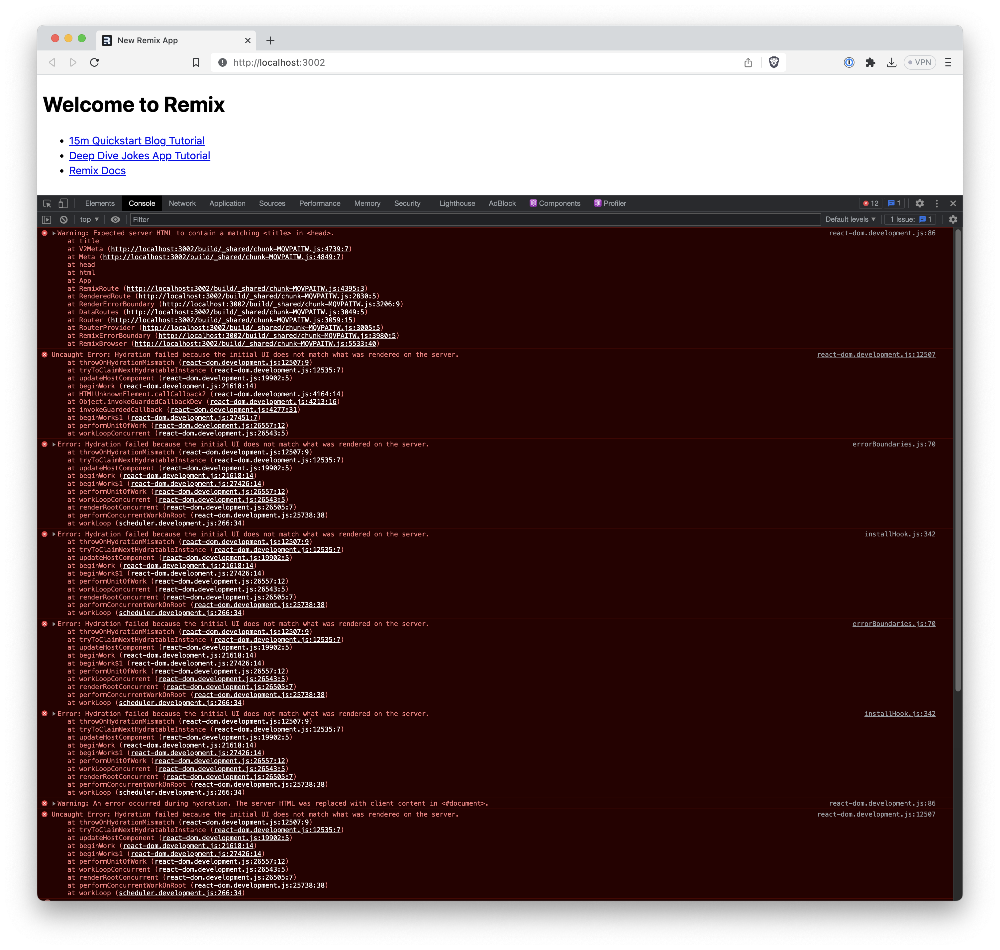

I've been putting off this article for way too long. It's time for me to talk about my experience with Remix, and my struggle with it in particular. I won't lie, part of the reason I was reluctant to write this piece was the community the framework has cultivated around itself. Everybody is **extremely** excited about Remix. I get it, I do, the framework is fantastic and brings a ton of innovation that the competitors are catching up to years later. And yet this unanimous praise makes it difficult to criticize the thing and, trust me, there are points to bring up when talking about any framework, library, or tool, and Remix is no exception here.

In light of all the tomatoes you've picked up to throw at me, let's settle on a few things before you read any further, alright?

1. I think **Remix is a great framework**. It's been praised countless times and I find most of that praise well-deserved.
2. **I will not be mentioning Remix's advantages**. This isn't a comparison article and neither is it a proper critique. If you haven't heard of Remix before, I'd suggest you go do that, build an app or two on your own, and then come back here. I don't wish to make you biased toward what could've been your favorite framework for years to come.
3. I am going to write about **my subjective experience**. It may not coincide with yours. It may be the exact opposite of yours. That doesn't invalidate either of them so let's remain civil and respectful.

Okay, I hope we are all good here and can continue.

## The Struggle

Unless you've been living under a rock, you've likely heard about Remix one way or another. Remix is a full-stack JavaScript framework. In fact, at the moment of writing this, I'd even go as far as to say it is _the only_ truly full-stack JavaScript framework out there. At least, it's been the first one in my memory to give developers actual full control of their routes, unlike magic APIs that describe server-side actions alongside your client-side code.

You've also likely read all the praise threads about Remix and how incredible it is. I won't lie, it _is_ pretty incredible. It made it all the more odd that when I first tried building an actual app with it I felt conflicted. I felt like everybody was utilizing this new thing to its fullest but whenever I reached to solve a problem with Remix I created two new ones. At first, I wrote it off as my lack of experience and moved on. But as I worked with the framework more and more, certain things kept repeating even after I felt quite comfortable when it came to Remix's side of things.

Once I tentatively (and carefully) posted about some of my struggles on Twitter, I found out that I wasn't alone. My friends also replied that they were struggling with certain things, and that gave me that final nudge to sit down and write about some of those (well, more like coming up with a draft and forgetting about it for a few months in my typical fashion).

## Struggle #1: Developer Experience

Remix nails some of the most complex aspects of development with eye-opening ease. That's why it's so jarring that it seems to ignore a big chunk of developer experience surrounding the usage of the framework.

It's been almost ten years since JavaScript applications have stopped being just JavaScript, whether you share that ideology or not. Real-world applications ship CSS and SASS, may use technologies like GraphQL, and can be written in other languages, like TypeScript or Reason. And they do all that _as a part of the application_. A project without a bundler these days is as rare as a tweet not mentioning ChatGPT. And Remix too comes with a bundler, using esbuild to make the magic happen.

The issue is, it abstracts the bundler and the bundling process so much that you, the developer, have no control over it. Now, the last thing I want is to meddle with a framework's build process. Brrgh. But it's still _my application_ and I dislike whenever tools take control away from me. Let me give you an example.

I like writing my GraphQL operations using their SDL syntax (i.e. `*.gql` files). It feels natural and less verbose than using object-based operation declarations. However, you have to have some processing for those `*.gql` files to transpile them back to JavaScript. You need a loader. That's not a big deal though, as every modern bundler comes with a way to control how certain modules are processed, including esbuild that's used in Remix. But there's no way to affect module handling _from_ Remix. Its configuration doesn't allow extending esbuild or affecting the build pipeline in any other way. This translates to a simple realization: I can't use a commonly established practice because Remix doesn't allow me to.

Here's a different example. I like Tailwind, it saves me a ton of time. Tailwind works through PostCSS so, yet again, you need a module processing pipeline (CSS files → PostCSS → Tailwind plugin). You may start to get what I'm coming at here.

> Remix has shipped the (experimental) Tailwind support recently, which is great! Unfortunately, it doesn't automatically negate my point.

It's crucial for you to understand one thing: a framework doesn't own your build, _you_ do. And when that build fails during another deployment, it's not the framework that will be spending its time debugging it, it will be _you_. Moreover, locking away an established pattern of letting the end developer control their builds is a huge limitation that doesn't provide any objective advantages to the developer whatsoever.

So, what does Remix offer for those cases? The only recommendation I found, and the one that's commonly used in the wild, is using tools like `pm2` to implement the build orchestration manually. I'm extremely skeptical about this recommendation, to say the least. Even if you ignore that `pm2` is _not_ a build orchestration tool (it's a Node.js process monitoring tool) and provides you with no means to describe parallel, sequential, and inter-dependent build steps, it is simply inefficient to force the developer to dive into Gulp era of build orchestration (Gulp is still a phenomenal task orchestration tool and I have, in fact, used it in some of my Remix projects!).

It's a no-brainer that Remix will, eventually, give back the rightful control over the build to its users. But it didn't do that back when I was working with it, and it hasn't done that yet.

## Struggle #2: Routing Is (Too) Magical

Routing is what makes Remix stand out. In the end, it's created by folks who have years of experience in shipping industry-standard client-side routing libraries. I didn't expect less from Remix and it certainly didn't disappoint.

Until I had to write routes. Lots of them. If I got a nickel every time I had to rummage through their docs to remind me about the correct syntax to group routes I'd be working open-source full-time now (you can still [support me on that goal](https://github.com/sponsors/kettanaito), if you wish). I know that routing is hard but I can't say that Remix's routing syntax is the most obvious one. It simply contains way too much magic for me to remember, especially since I've never used that syntax in any other solutions before (`__`, `?index`, `[.png]`, all these magical friends is not something my brain spits out on command).

To add insult to injury, back in the day there used to be no “Routing” section in their documentation! Routing syntax and rules were scattered across data fetching and layout sections, making them hard to find and even harder to put together. Now, Remix has the [Routing page](https://remix.run/docs/en/main/guides/routing), and it's a great improvement.

I can't say the routing syntax has changed much over this time. I haven't used the flat routes from V2 and don't have any opinion on them as a result yet. Once again, you may find this routing the next most natural thing to breathing but I haven't. I wonder sometimes whether file system-based routing is truly the best thing there is.

## Struggle #3: It's Still Raw

Remix hasn't been around for that long but it positions itself as a production-ready, viable option when it comes to choosing the framework for your next project. While it checks all the boxes to make that statement, a tinge of strange experience slips through here and there.

For example, I am terrified of updating Remix. I've had my share of cryptic error messages and things breaking when jumping between _minor_ versions of post-1.0 releases (1.7 → 1.9 was a story to tell). I would be the last person to blame the team for breaking the consumers. However, as the consumer, I really don't want to spend any time deciphering errors like this when all I want is to ship the next feature in my app:

```jsx
[1] [1] TypeError: Cannot read properties of undefined (reading 'v2_meta')
```

Remind you, this wasn't a breaking release but my application broke nonetheless.

Even when it comes to the default, out-of-the-box experience, Remix adds a grain on salt to the mix. Bootstrapping a fresh Remix app and opening it in the browser gives you a screen-long red wall of hydration errors:



> I've noticed this wall of errors only happens in Brave, and in Chrome you get a single humble error still.

I wouldn't pick on things like this if this wasn't literally the first thing you see opening a new Remix app. This clearly hints at some internals issues and leaves a sour aftertaste for the user.

Luckily, the time will fix all this. Remix has gone a long way from the moment I first picked it up and until now, and it will undergo even more improvements in the upcoming years. Until then, I see it as a heavily-developing framework.

## Struggle #4: Control not default

I hope you are still with me because I saved the best for last.

Remix is the first JavaScript framework where I truly felt in control (even despite it locking away the build process). Any route can render a component. Any route can be a server-side route, handling request and serving data. Any route _can be both at the same time_. That is one of the things that, once you're used to, you can't stop craving for it in any other framework you try.

Control is a double-edged sword. When you're driving a car, you are clearly in control behind the steering wheel—you decide where the thing would go, whether to speed up or slow down, or if you need to crank up the AC on the back seats or open a window. You are in charge and you control the things that _matter to you_, the driver. Now, imagine if you'd also have to monitor and correct the voltage coming to your car's electronics so it wouldn't short-circuit, or had to manually enter the amount of fuel you wish to burn every time you press on the gas pedal. That is even more control, so why doesn't that feel better?

Because control is only good when it concerns the things of your immediate interest. If you start managing things you don't care about right now, or at all, control becomes a nuisance that degrades your car driving experience.

Remix gives you control. It gives you _a lot_ of control. Much so that I often find myself working on things that are barely related to what I'm trying to build. The most painful memory being my attempts to manage any kind of static assets. Allow me to back this point up with a concrete example.

I chose Remix to build a portfolio for my friend, who is an artist. Naturally, I had to create a few pages that showcase her work on the site. She didn't have much site management experience and I didn't want to onboard her to WordPress and friends, so I decided to use MDX to describe each individual work. It's plain text, it's easy to understand and edit, and I even wrote some basic instructions on how to create new portfolio entries whenever she needs to. Besides, I've worked a lot with MDX in the past, that was supposed to be a breathe!

Until it wasn't. One particularly painful moment was handling image assets on the work detail page. Roughly, that page translated to the following MDX:

```jsx
---
title: Castle In The Sky
thumbnail: ./castle.jpg
---

Here's a short description of the work. A neat way for an artist
to bring more context and life to their creations.


```

You can imagine the most basic MDX blog setup around this:

1. Individual works kept under `works/{slug}.mdx`.
2. A template described under `src/routes/work/$slug.jsx`.
3. And the MDX → HTML pipeline that locates, converts, and renders the contents.

And integrating this MDX setup into Remix was largely just that, except for those images.

See, Remix won't load those images (in fact, any static assets) from the file system if they are next to your `*.mdx` files. Why? Because nothing is instructing Remix to _serve_ them from there. To get what is a basic assets imports in Remix you have to create a designated route, describe a `loader` in there, resolve requested assets from the right path in file-system, and respond with them.

```jsx
// src/routes/blog/[slug]/$asset[.jpg]
export const loader = async ({ request }) => {
  const url = new URL(request.url)
  const assetPath = await resolveAsset(url.pathname)
  const buffer = await fs.readFile(assetPath)

  return new Response(buffer, {
    headers: { 'Content-Type': 'image/jpg' },
  })
}
```

I may be spoiled beyond saving by Gatsby and Astro, but when I reference a relative image in my Markdown I just expect the framework to resolve it by itself. Having to manually write a server-side handler to resolve these static assets felt like I was adding missing bits of the framework instead of working on my application, and, needless to say, it was not an experience I want to relive.

But hey, this was my custom MDX setup so there was a decent possibility I just screwed something up. To give the framework a chance, I tried the default, barebones [MDX example](https://remix.run/docs/en/main/guides/mdx) as described in their docs to find the behavior exactly the same. Sadly, Remix will not pick up static assets relatively to your routes, and the official recommendation is to either write a `loader` for them or devise a custom copy script to flush all the assets to the `public` directory during the build. This reminds me of the Gulp era yet again with all the manual assets copying, which is also not the time period I want to come back to.

This point stretches beyond working with MDX. Remix gives you control, it does, but it fails to give you sensible defaults in certain areas, forcing you to fill the gaps by yourself. To this, I have a simple yet true rule:

<Quote>
  Every time you're writing code for your framework and not your product, the
  framework fails.
</Quote>

## Closing thoughts

Looking at all this struggle you may think I dislike Remix. But I don't. On the contrary, I find Remix to be a great tool, and I've experienced it myself how much it shines when developing data-heavy, dynamic applications. I believe the main cause for my struggle was simply choosing the wrong tool for the job.

I would pick Remix to build my next startup. I would not pick Remix to build my blog, portfolio, or other kind of, effectively, static websites. This doesn't make the framework bad in any way, it just reminds me that Remix is a tool and certain tools are better than others for certain needs.
