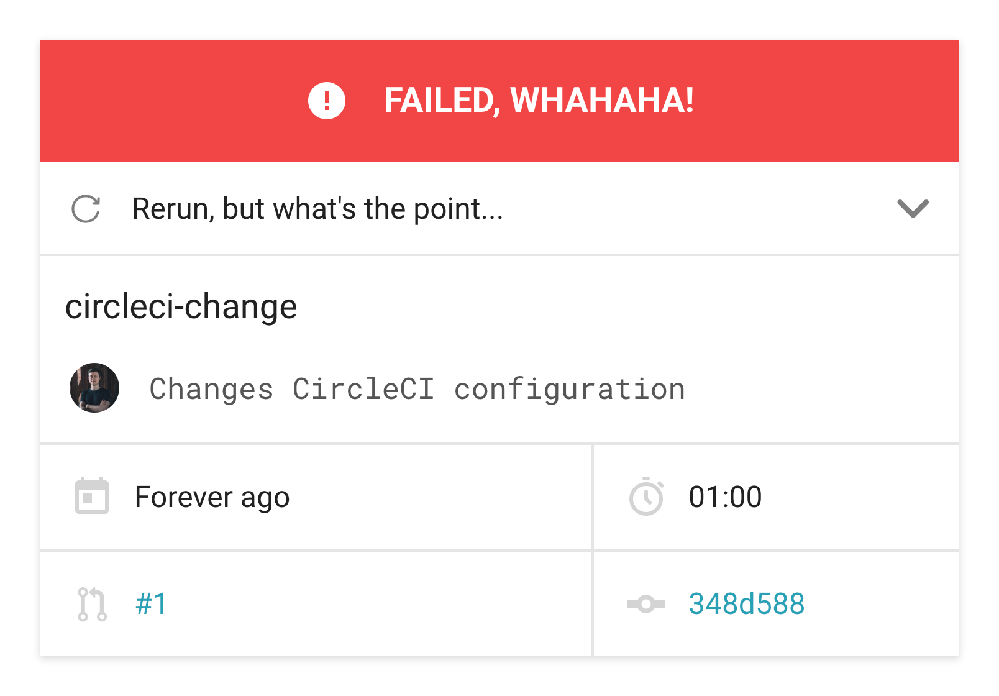
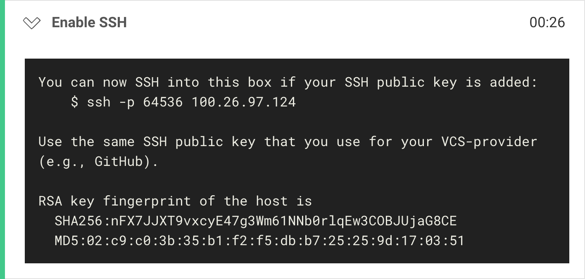
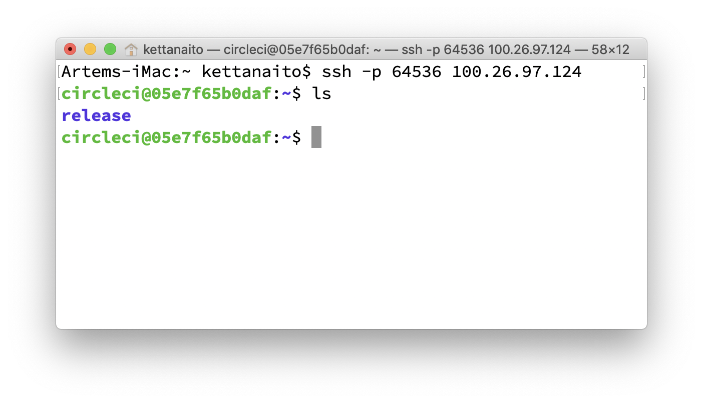

## Introduction

I have been using [CircleCI](https://circleci.com/) in my projects for more than two years and I love it! Well, at least until it comes to changing `.circleci/config.yml`. If you have any experience with CircleCI you know what a complicated beast its configuration may become. However, I am not here to complain, but to share how my lack of experience prevented me from debugging failing jobs.

I am ashamed to admit that any significant change in CircleCI config used to take me about 30 failing workflows to get right. By the time I get there I begin to hate the red color so much.



In this post I would like to share a mind-blowing technique of debugging failed jobs suggested to me by [Ricardo Feliciano](https://twitter.com/FelicianoTech). I will also drop in a few personal suggestions and make the process more smooth by describing it step-by-step.

---

## The problem

In order to debug any issue one has to reliably reproduce it first. There are multifold of things that can affect the issue's reproduction: environment, connection speed, asynchronicity, black magic. Needless to say when your CI runs remotely all those factors are at play.

## Running job with SSH

In order to debug a failed job using SSH it needs to be run with SSH first. In this article we are going to do that directly from the CircleCI UI:

1. Open the failed job on CircleCI.
1. Locate the "Rerun ???" / "Rerun workflow" button.
1. Open the dropdown and choose "Rerun job with SSH" option.


Clicking on the option will run the respective job anew, yet this time CircleCI will issue an SSH connection to the remote machine. You can notice that a new step has been added that describes details of that connection:



The connection details are likely be different in your case, but what you are interested in are the machine's host (`100.26.97.124`) and port number (`64536`). CircleCI would also print out a shorthand connection command, but let's skip that one for now. First let's ensure that our local computer has an SSH key set up, otherwise any request to reach the remote machine will be denied.

## Into the remote!

- What is SSH connection
- Why do we need a key?
- Where to get the key (admin / not CI admin)

### Using SSH key

Connecting via SSH is like opening a door: you need a key. It bears some information about a connector, and helps the server decide whether access should be granted.

- Do I need a key?
- Where the keys are stored?

By default, attempts to connect to the remote machine using `ssh` would use the SSH key file added in your SSH agent. There can be two issues with this: you either don't have any SSH key, or have multiple ones.

#### Set up an SSH key in GitHub

To create an SSH key and attach it to your GitHub profile please follow the official guide: [Generating a new SSH key and adding it to the ssh-agent](https://help.github.com/en/github/authenticating-to-github/generating-a-new-ssh-key-and-adding-it-to-the-ssh-agent).

#### Using explicit key

In case you have got multiple SSH keys you would have to specify which one to use to connect to the remote machine. Provide the path to the same SSH key you use for GitHub as the value of the `-i` flag in `ssh` command:

```bash
$ ssh -i ~/.ssh/id_rsa -p 64536 100.26.97.124
```

### Establishing connection

Using a UNIX-based computer, you can connect to a remote SSH server using the `ssh` command:

```bash
$ ssh -p 64536 100.26.97.124
```

> Answer "yes" if prompted with "Are you sure you want to continue connecting".

..

> TODO: Add instructions for Windows.

When successfully executed, you will notice your terminal's host changing from the local computer name to the remote machine's name. Any commands issued in this process are executed on the remote machine.



By default you are going to see the `/home/circleci/` directory opened. Depending on your CircleCI configuration you will have a different directory tree there. In my case I have configured my job to run in the `~/release` folder:

```yml
version: 2
jobs:
  build:
    working_directory: ~/release
    steps:
      - checkout
      - ...
```

Pay attention to your setup and directory structure when applying commands used in this article. I am going to list those according to my setup to remain consistent.

## Taking a snapshot

Working with the remote file-system s helpful, yet you might quickly find yourself limited. It is another environment, which lacks your favorite IDE and all those helpful tools you use for debugging. It may be helpful to know how to download directories and files from the remote machine.

Although you should strive towards your project being reproducible, I highly recommend to download a complete snapshot of the file-system, _including installed dependencies_. This way you eliminate any possible deviations and operate on the 1-1 instance of your project from the failed job. Depending on the project's (and its dependencies) size, transferring its entire directory may take a significant amount of time. We can compress the working directory into a tarball to decrease its size and make the download procedure faster.

Being on the remote machine let's compress our current working directory into a tarball archive:

```bash
$ tar -czvf snapshot.tar.gz ./release
```

- `-c` create an archive,
- `-z` compress the archive using gzip,
- `-v` display progress in the terminal (verbose),
- `-f` accept a file name of the archive.

After the archive is created we can transfer `snapshot.tar.gz` using SCP ([Secure Copy Protocol](https://en.wikipedia.org/wiki/Secure_copy)). Open a new terminal window, because **we need to be on the local machine** to do this step.

```bash
$ scp <OPTIONS> <USER>@<HOST>:/<SRC_PATH> <DEST_PATH>
```

```bash
$ scp -P 64536 circleci@100.26.97.124:/home/circleci/snapshot.tar.gz ~/Desktop
```

- `-P` connection port to use (default is `20`).

This command will copy the file at `/home/circleci/snapshot.tar.gz` from the remote machine to our local's `~/Desktop`. Unarchive the snapshot of the CI and debug it as if it was a regular folder. Well, because it is.

## Running job locally

- Your environment is still a point of deviation that may get in a way of reliably reproducing the issue
- Consider using CircleCI CLI to run a job

---

## Links & Materials

- [Debugging with SSH](https://circleci.com/docs/2.0/ssh-access-jobs/) (CircleCI documentation)
- [What are SSH keys?](https://jumpcloud.com/blog/what-are-ssh-keys/) by JumpCloud
