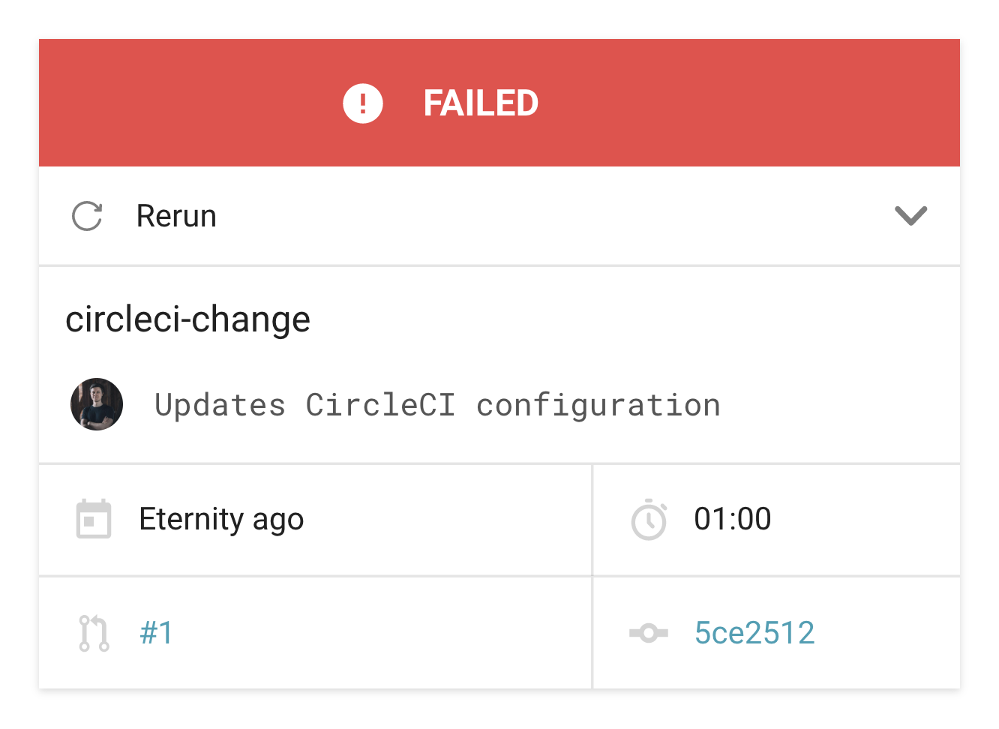
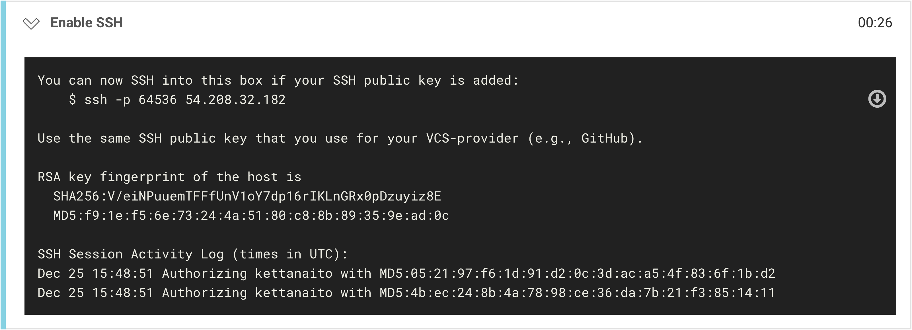

## Introduction

I have been using [CircleCI](https://circleci.com/) in my projects for more than two years now and I love it! Well, at least until it comes to changing `.circleci/config.yml`. If you have any experience with CircleCI you know what a complicated beast its configuration may become. However, I am not here to complain, but to share how my lack of experience prevented me from debugging failing jobs.

I am ashamed to admit that any significant change in CircleCI config used to take me about 30 failing workflows to get right. By the time I get there I begin to hate the red color so much.



Today I would like to share with you a great technique to debug CircleCI jobs using SSH connection to the remote machine. Basically, this would allow you to open the \_exact state of the remote machine that runs your job, navigate it, read files and execute commands.

### Debugging cycle

Debugging an issue is impossible without reliably reproducing it. There are multifold of things that can affect the issue's reproduction: environment, connection speed, asynchronicity, black magic. Needless to say when your CI runs remotely all those factors are at play.

---

## Running a job with SSH

In order to debug a failed job using SSH it needs to be run with SSH first. Luckily, this is possible from the CircleCI UI straight away:

1. Open the failed job on CircleCI.
1. Locate the "Rerun ???" / "Rerun workflow" button.
1. Open the dropdown and choose "Rerun job with SSH" option.


Clicking on "Rerun job with SSH" will run the job anew. This time, however, CircleCI will issue a SSH connection to the remote machine. Take a look at the respective step of the rerun job for more details:



It is important to notice a machine's host (`54.208.32.182`) and port (`64536`). We are going to use those to connect to the remote machine.

> The hostname and port number may be different in your case. Take the exact data printed by the CircleCI job.

## Connecting to the remote machine

Using a UNIX-based computer, you can connect to a remote SSH server using the `ssh` command from your terminal:

```bash
$ ssh -p 64536 54.208.32.182
```

When successfully executed, you will notice your terminal's host changing from the local computer name to the remote machine's name.

Any commands issued in this process are performed _on the remote machine_.

### Use the same SSH as GitHub

## Downloading files

Working with the remote file-system via SSH is helpful, yet you might quickly find yourself limited. It is another environment, which lacks your favorite IDE and all those helpful tools you have got for debugging. It is useful to know how to download a file, or an entire working directory, from remote to your local.

Although you should strive towards your project being reproducible, I highly recommend to download a complete snapshot of the file-system, _including installed dependencies_. This way you eliminate any possible deviations and operate on 1-1 instance of your project from the failed job.

Depending on the project's (and its dependencies) size transferring its entire directory may take a significant amount of time. We can compress the working directory into a tarball to decrease its size and make the download procedure faster.

```bash
$ tar ...
```

With the tarball written into `...` let's download it using the following command:

```bash
$ scp -P <PORT> ...???...
```

---

## Materials

- Links to useful materials on this topic
